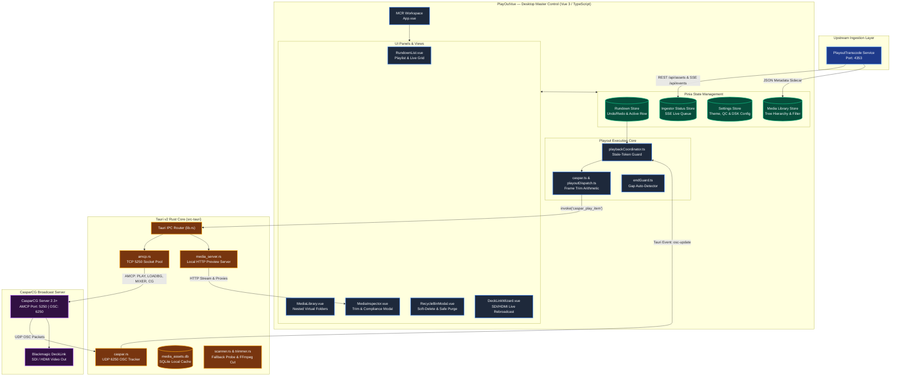
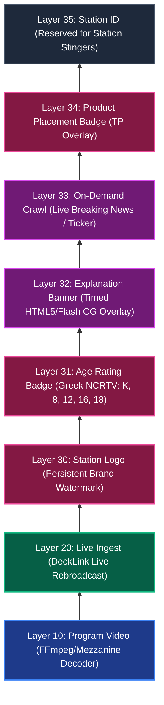

# PlayOut (PlayOutVue)

[](https://github.com/Soranokuni)
[](https://opensource.org/licenses/MIT)
[](https://tauri.app/)
[](https://vuejs.org/)
[](https://www.rust-lang.org/)
[](https://casparcg.com/)
[](https://www.blackmagicdesign.com/)

**PlayOut** (PlayOutVue) is a Windows-first, broadcast-grade Master Control Room (MCR) playout automation controller developed by **[Soranokuni](https://github.com/Soranokuni)**. Engineered using **Vue 3, Vite, Tauri v2, and Rust**, PlayOut delivers deterministic, frame-accurate playout automation, non-destructive trimming, downstream keyer (DSK) graphics, Greek NCRTV compliance automation, and real-time CasparCG playback synchronization.

PlayOut operates in synergy with **[PlayoutTranscode](https://github.com/Soranokuni/PlayoutTranscode)** (its companion media ingestion engine) to ingest, validate, and broadcast frame-accurate progressive and interlaced mezzanine assets.

---

## System Architecture & Control Flow

The architecture decouples UI rendering from playout execution. Playout commands execute over AMCP to CasparCG, while real-time frame progress is tracked via an asynchronous UDP OSC feedback listener.



---

## CasparCG MCR Layer Stack

PlayOut enforces a strict, collision-free **8-layer channel registry** (`caspar_layers.rs` and `CASPAR_LAYERS` in TypeScript). Each producer type has documented lifecycles, mixer permissions, and automatic take/clear rules.



### Layer Specification Table

| Layer | Name | Producer Type | Lifecycle & Behavior | Supports `MIXER` |
|---|---|---|---|:---:|
| **10** | **Program Video** | FFmpeg Decoder | Item-level (`PLAY`, `LOADBG`, `CLEAR`). Cleared on manual live take. | ❌ (Raw) |
| **20** | **Live Input** | DeckLink Producer | Live item take (`PLAY 1-20 DECKLINK DEVICE 1`). Suppresses Layer 10. | ❌ (Raw) |
| **30** | **Station Logo** | Image (`PNG`/`SVG`) | Channel watermark; always-on; survives rundown item advances. | ✅ |
| **31** | **Age Rating** | Image (`PNG`) | Item-level; positioned per station profile (e.g. top-left / top-right). | ✅ |
| **32** | **Explanation** | CG Template | Timed advisory banner displayed during the first N seconds of a clip. | ❌ (Self-pos) |
| **33** | **Crawl Ticker** | CG Template | User-toggled breaking news ticker with live text/speed `CG UPDATE`. | ❌ (Self-pos) |
| **34** | **TP Badge** | Image (`PNG`) | Product Placement indicator; toggled per rundown item. | ✅ |
| **35** | **Station ID** | Reserved | Dedicated layer for animated channel identifiers. | ✅ |

> [!NOTE]
> **Mixer vs CG Template Rule**: `MIXER FILL` and `MIXER OPACITY` commands are strictly forbidden on CG template layers (Layers 32 and 33) to prevent squashing self-positioned HTML/Flash templates.

---

## Core Capabilities

### 1. Master Control Playout & Auto-Advance
- **Deterministic Frame Trim Arithmetic**: Accurately computes frame in/out points using broadcast rationals (e.g., `25/1` PAL, `30000/1001` NTSC) preventing A/V sync drift.
- **Stale-Token Playback Protection**: Dispatches commands with monotonic token tracking to ensure slow AMCP socket responses never override an operator's manual Take.
- **Continuous Auto-Advance & Gap Guard**: Automatically transitions between rundown items via OSC frame milestones and arms visual gap warnings for missing media.
- **Undo / Redo Serialization**: Full snapshot history for rundown editing, reordering, duplicate, and delete operations.

### 2. Greek NCRTV Compliance & Graphics Engine
- **NCRTV Rating System**: Native support for statutory age categories:
  - `K` (Suitable for all)
  - `8` (Suitable for ages 8+)
  - `12` (Suitable for ages 12+)
  - `16` (Suitable for ages 16+)
  - `18` (Prohibited for minors)
  - `TP` (Product Placement warning)
- **Automated Advisory Timelines**: Displays regulatory explanation banners during the required start-of-program window before auto-fading.
- **Live Crawl Ticker**: Real-time ticker with adjustable speed, instant text updates, and emergency override capabilities.

### 3. Media Library & Virtual Tree Management
- **Nested Virtual Folders**: Organize thousands of assets into arbitrary-depth directory trees without moving physical files on disk.
- **Folders-on-Top Sorting & Tree Guides**: Clean visual hierarchy with subtle guide lines and quick folder-picker dialogs.
- **Batch Actions & Multi-Select**: Select multiple media files with `Shift` or `Ctrl`, and append them consecutively into the rundown via `F8` or `Shift+F8`.

### 4. Recycle Bin & Reference-Protected Purge
- **Soft-Delete Lifecycle**: Deleted media moves to a protected Recycle Bin stage.
- **Reference-Check Protection**: Prevents purging files currently queued in any active or scheduled rundown.
- **Pulsing Safety Alert**: Visual confirmation barrier with auto-purge timers to prevent accidental physical data loss.

### 5. Local Media Server & Streaming Preview
- Built-in Rust HTTP server (`media_server.rs`) streams media directly into the browser/Vue UI.
- Automatically generates on-the-fly FFmpeg proxy video for mezzanine codecs not natively decodable by Chromium/WebKit.

---

## Keyboard Shortcuts & Operator Controls

| Shortcut | Action | Scope |
|---|---|---|
| <kbd>Enter</kbd> / <kbd>Space</kbd> | **Take / Play** selected rundown row immediately | Rundown |
| <kbd>F8</kbd> | **Append** selected library item(s) after the active playing row | Media Library |
| <kbd>Shift</kbd> + <kbd>F8</kbd> | **Prepend / Insert** selected item(s) directly before the active row | Media Library |
| <kbd>Ctrl</kbd> + <kbd>↑</kbd> | Move selected rundown item(s) **Up** | Rundown |
| <kbd>Ctrl</kbd> + <kbd>↓</kbd> | Move selected rundown item(s) **Down** | Rundown |
| <kbd>Shift</kbd> + <kbd>↓</kbd> | **Duplicate** selected rundown row | Rundown |
| <kbd>Delete</kbd> / <kbd>Backspace</kbd> | **Remove** item from rundown / Move library asset to Recycle Bin | Global |
| <kbd>Ctrl</kbd> + <kbd>Z</kbd> / <kbd>Ctrl</kbd> + <kbd>Y</kbd> | **Undo** / **Redo** last rundown modification | Rundown |
| <kbd>Ctrl</kbd> + <kbd>K</kbd> | Open **Quick Command Palette** | Global |

---

## Directory Structure

```text
PlayOut/
├── src/                          # Vue 3 Frontend
│   ├── assets/                   # CSS styles, SVGs, and HTML5 CG templates
│   ├── components/               # UI Components (RundownList, MediaLibrary, Inspector, etc.)
│   ├── composables/              # Reusable state & keyboard routing hooks
│   ├── lib/                      # Pure business logic (frameMath, compliance, dispatch)
│   ├── services/                 # Hardware & Playout services (caspar.ts, obs.ts)
│   ├── stores/                   # Pinia Stores (rundown, mediaLibrary, settings, ingest)
│   └── utils/                    # Timecode formatters, API clients
├── src-tauri/                    # Tauri v2 Desktop Core (Rust)
│   ├── src/
│   │   ├── amcp.rs               # CasparCG TCP AMCP Command Protocol
│   │   ├── caspar.rs             # OSC Feedback UDP Server & State Tracking
│   │   ├── caspar_layers.rs      # Single-Source-of-Truth Layer Registry
│   │   ├── media_server.rs       # Local HTTP Streaming & Proxy Generator
│   │   ├── ingestor_api.rs       # PlayoutTranscode REST/SSE Client Bridge
│   │   ├── scanner.rs            # Filesystem Scanner & Fallback Metadata Probe
│   │   └── trimmer.rs            # FFmpeg Extraction & Lossless Trimmer
│   └── tauri.conf.json           # Application manifest, windows, security CSP
└── docs/                         # Operational contracts and test specifications
```

---

## Development & Build Setup

### Prerequisites
1. **Node.js**: `^20.19.0 || >=22.12.0`
2. **Rust**: `1.77.2+` with `rustup`
3. **Microsoft C++ Build Tools**: Visual Studio 2022 C++ x64/x86 build tools
4. **CasparCG Server**: Version 2.3+ (installed locally or reachable over the local network)
5. **PlayoutTranscode**: Ingest service running on port `4353`

### 1. Install Dependencies
```powershell
npm install
```

### 2. Run in Development Mode
Launch the complete desktop application with hot-reloading:
```powershell
npm run tauri dev
```

Run frontend in browser-only mode:
```powershell
npm run dev
```

### 3. Run Automated Tests
```powershell
npm run test
```

### 4. Build Production Installer
```powershell
npm run tauri build
```
The installer executable (`.msi` / `.exe`) will be generated in `src-tauri/target/release/bundle/`.

---

## Author & Project Information

- **Author**: **[Soranokuni](https://github.com/Soranokuni)** (Alex Fountas)
- **Email**: [shadowsora13@hotmail.gr](mailto:shadowsora13@hotmail.gr)
- **Repository**: [https://github.com/Soranokuni/PlayOutVue](https://github.com/Soranokuni/PlayOutVue)

---

## License

This project is licensed under the **MIT License**.
