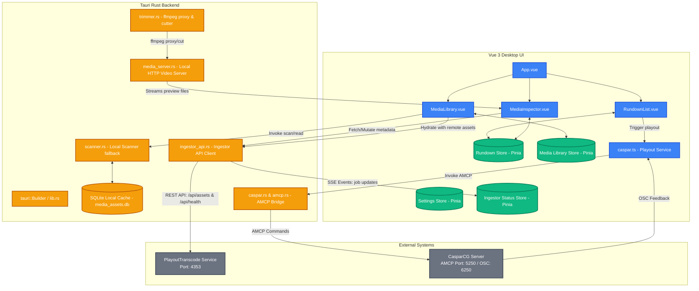

# PlayOut (PlayOutVue)

PlayOut is a Windows-first desktop playout controller built with Vue 3, Vite, Tauri v2, and Rust. It is designed for small broadcast environments, channel branding, and operator-driven transmission workflows where a single application manages media browsing, rundown editing, previewing, non-destructive/destructive trimming, and channel output control.

PlayOut operates exclusively with the **CasparCG** playout backend, utilizing AMCP for control and OSC feedback for frame-accurate playback tracking. It integrates with **PlayoutTranscode**, a companion ingestion and preparation service, to hydrate its media library with broadcast-compliant, pre-transcoded mezzanine files.

---

## System Architecture & Control Flow

The diagram below details the architecture of the PlayOut desktop shell, its internal modules, its local media server, and its integration with both PlayoutTranscode and CasparCG.



---

## Core Capabilities

- **Media Library Integration**: Queries the PlayoutTranscode REST API to populate the local media catalog. Keeps a localized fallback scanner for standalone directories.
- **Rundown & Playlist Management**: Manages multiple persisted playlists, featuring drag-and-drop reordering, gaps/planning points, and persistent operator execution controls.
- **Non-Destructive Trimming**: Sets frame-accurate `trim_in_ms` and `trim_out_ms` properties in rundown items. During playout, the dispatcher computes precise frame-offset cues for CasparCG.
- **Compliance & Channel Branding**: Triggers Blackmagic DeckLink downstream keyer (DSK) controls and graphics templates for rating badges (`logo.png`, `K.png`, `8.png`, `12.png`, `16.png`, `18.png`, `TP.png`) directly onto dedicated CasparCG layers.
- **Embedded Local Preview**: Tauri runs a local HTTP media server that streams assets to the video preview elements, automatically using ffmpeg to generate proxy streams for non-browser-decodable formats.

---

## Directory Layout

```text
src/
  ├── components/       # Vue UI components (RundownList, MediaLibrary, MediaInspector, etc.)
  ├── composables/      # Shared state utilities (useDragState, etc.)
  ├── services/         # Playout logic (caspar.ts, playout.ts)
  ├── stores/           # Pinia state management (settings, rundown, library, ingestorStatus)
  └── utils/            # Arithmetic and validation utilities (frameMath, api)
src-tauri/
  ├── src/              # Rust desktop modules (caspar config, local scanner, trimmer, db, etc.)
  └── tauri.conf.json   # Desktop app build properties & resources configuration
```

---

## Development Setup

### 1. Prerequisites
- **Node.js** `^20.19.0 || >=22.12.0`
- **Rust Toolchain** `rustup` compatible with version `1.77.2` or higher
- **Microsoft Visual C++ Build Tools** (for Tauri compilation on Windows)
- **CasparCG Server** (running locally or accessible via network)
- **PlayoutTranscode Service** (optional but highly recommended for watch-folder workflows)

### 2. Install Dependencies
```powershell
npm install
```

### 3. Run in Development
For the full desktop client environment:
```powershell
npm run tauri dev
```
For web UI development in the browser:
```powershell
npm run dev
```

### 4. Build Production Executable
```powershell
npm run tauri build
```
The resulting installers and binaries will be written to `src-tauri/target/release/bundle/`.

---

## Keyboard Shortcuts

- `Enter` or `Space`: Play current item from the active rundown row.
- `Delete` or `Backspace`: Delete the selected rundown row.
- `Ctrl + Arrow Up` / `Ctrl + Arrow Down`: Move selected rundown rows up or down.
- `Shift + Arrow Down`: Duplicate the selected row.
- `F8`: Append the selected library item after the active rundown row.

---

## License

No license has been declared yet. If you plan to distribute this workspace, define appropriate license terms and evaluate compliance for bundled runtime components like FFmpeg and Blackmagic drivers.
