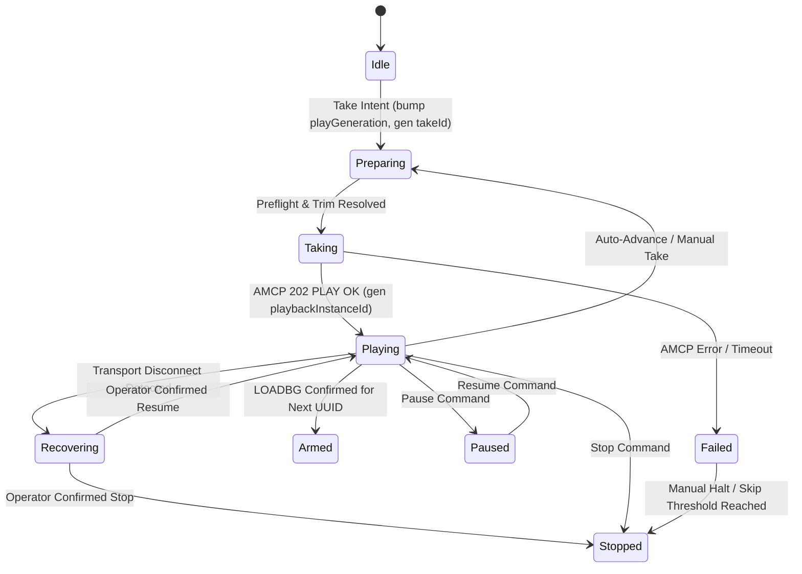

# Playback Operational Contract

This document defines the operational contract governing playback authority, state transitions, state ownership, event fencing, and diagnostic logging between **PlayOutVue** and **PlayoutTranscode**.

---

## 1. Core Principles

1. **Identity over Position**: Playback authority belongs strictly to immutable item `UUID`s. Array indices are used exclusively for UI ordering visualization and diagnostic logging. Array index must **never** be stored as the authoritative target across `await`, timer, render, AMCP, or IPC boundaries.
2. **State Ownership**:
   - The TypeScript `PlaybackCoordinator` is the **sole authority** for operator intent and desired playback state.
   - Native Rust code owns TCP socket lifecycle, command serialization, response framing, and observed CasparCG channel state. Native code must **never** independently select rundown items or initiate automatic advance.
3. **Dual-ID Event Fencing**:
   - **`takeId`**: Synchronously generated UUID created at the moment of take intent (before any `await`). Fences the interval between click and AMCP ACK.
   - **`playbackInstanceId`**: Generated ONLY after CasparCG returns a confirmed `PLAY` response (`202 PLAY OK` / `200 OK`).
   - Every manual take, auto-advance, stop, or recovery increments `playGeneration`. Out-of-generation ACKs, ticks, or EOF signals are immediately discarded.

---

## 2. Contract Schemas

### 2.1 Playback Intent & Confirmed State

```ts
export type PlaybackSource = 'manual' | 'auto' | 'recovery';

export type PlaybackMode =
  | 'idle'
  | 'preparing'
  | 'armed'
  | 'taking'
  | 'playing'
  | 'paused'
  | 'recovering'
  | 'failed'
  | 'stopped';

export type PlaybackIntent = {
  takeId: string;                 // Created synchronously before async work starts
  playGeneration: number;         // Monotonic counter per playback channel
  targetItemId: string;           // Immutable rundown UUID
  rundownRevisionAtIntent: number;// Rundown revision snapshot
  source: PlaybackSource;
  createdAtEpochMs: number;
};

export type ConfirmedPlayback = PlaybackIntent & {
  playbackInstanceId: string;     // Created only after confirmed PLAY ACK
  confirmedAtEpochMs: number;
  channel: number;
  layer: number;
};
```

---

## 3. Structured Diagnostics Event Schema

Every diagnostic event logged by PlayOutVue or native services must conform to this schema:

```json
{
  "timestamp": "2026-08-10T21:05:00.000Z",
  "correlationId": "corr-uuid-1234",
  "takeId": "take-uuid-5678",
  "playbackInstanceId": "inst-uuid-9012",
  "playGeneration": 42,
  "itemId": "item-uuid-3456",
  "targetIndexAtDispatch": 2,
  "rundownRevision": 15,
  "source": "manual-row",
  "action": "TAKE_INTENT",
  "amcpCommandResult": "202 PLAY OK",
  "elapsedMs": 12,
  "redactedPath": "hmac_sha256_ab12cd34..."
}
```

### Path Privacy Rule
Diagnostic logs and export bundles must **never** contain raw filesystem paths, API tokens, cookies, or user credentials. Paths must be logged as `HMAC-SHA-256(canonicalPath, installSalt)` where `installSalt` is a per-installation secret stored in OS application data.

---

## 4. State Transition Machine


